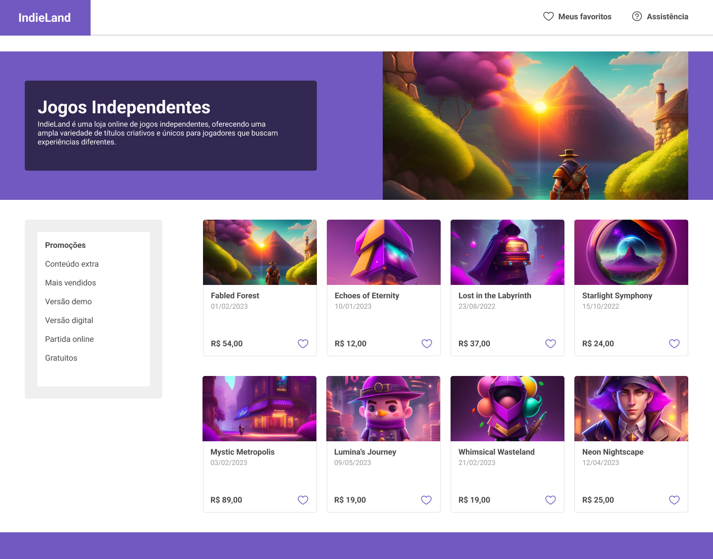

## IndieLand

Landing page of a e-commerce game store, developed in the "Coding with instructors" momento, at @Rocketseat.

> **Note**
> This project was made with the objective of practicing basics concepts like CSS grid and stylization with Tailwind. 

### Description:

The main concepts worked on in this project were the use of display grid, responsiveness of various elements and mobile development.

As a basic project developed in HTML and CSS, I developed it my way, using ReactJS and Tailwind, to practice the basic concepts and review already learned concepts of HTML and CSS.

### Preview:

<p align="center">
  
</p>

### Tech stack:
 
- [React JS](https://react.dev)
- [TypeScript](https://www.typescriptlang.org)
- [Git/GitHub](https://git-scm.com)

### Dependencies:

- [Phosphor-react](https://github.com/phosphor-icons/react)
- [Tailwind](https://tailwindcss.com)

### Usage:

You can clone this project and install the dependencies with the following command:


```sh
git clone https://github.com/EduVieira131/IndieLand
cd IndieLand
npm install
```